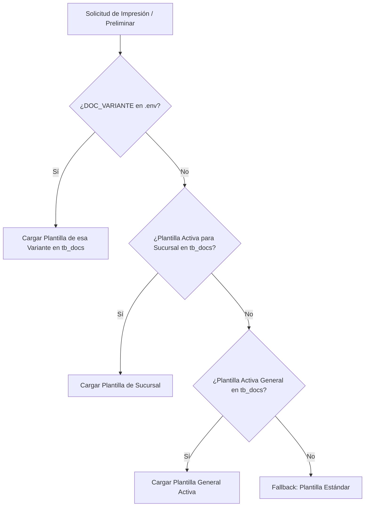

# 🛠️ Guía Maestra: Creación, Rotación y Configuración de Formatos PDF Personalizados

Este documento explica cómo crear formatos de documentos PDF personalizados (heredando o desde cero), cómo rotar o alternar entre ellos fácilmente desde el archivo `.env` o desde la base de datos (`tb_docs`), y cómo gestionarlos tanto en local como en el servidor compartido de **BanaHosting** (`ea-php83`).

---

## 📑 Tabla de Contenidos
1. [🔄 Cómo Rotar entre Formatos (Desde `.env` o desde la BD)](#1--cómo-rotar-entre-formatos)
   - [Método A: Rotación Instantánea vía `.env` (Sin tocar la BD)](#método-a-rotación-instantánea-vía-env-máxima-prioridad)
   - [Método B: Rotación vía Consola Artisan (`doc:activar`)](#método-b-rotación-vía-comando-artisan-recomendado)
   - [Método C: Rotación directa en la Base de Datos (`tb_docs`)](#método-c-rotación-directa-en-base-de-datos-tb_docs)
2. [📋 Ver el Estado Actual y Catálogo (`doc:activar --listar`)](#2--ver-el-estado-actual-y-catálogo-de-plantillas)
3. [✨ Crear Nuevos Formatos Automáticamente (`doc:crear-formato`)](#3--crear-nuevos-formatos-automáticamente)
   - [Modo Interactivo (Asistente)](#modo-interactivo-asistente)
   - [Heredar de PRENDAMÁS (Contratos notariales y estados de cuenta)](#heredar-de-prendamas)
   - [Crear desde Cero (Plantilla limpia)](#crear-desde-cero)
   - [Formato exclusivo para una Sucursal](#formato-exclusivo-para-una-sucursal)
4. [🚀 Comandos para Servidor Compartido en BanaHosting (`ea-php83`)](#4--comandos-para-servidor-compartido-banahosting)
5. [🎨 Estructura de Archivos y Variables Blade Disponibles](#5--estructura-de-archivos-y-variables-blade)

---

## 1. 🔄 Cómo Rotar entre Formatos

El motor de documentos de **Dev Empeños** (`DocumentService` y `TbDoc`) cuenta con un sistema jerárquico de resolución con 3 niveles:



---

### Método A: Rotación Instantánea vía `.env` (Máxima Prioridad)

Puedes cambiar los formatos de todo el sistema en un segundo simplemente editando el archivo `.env`.

Abre tu archivo `.env` y agrega o modifica la siguiente variable:

```env
# Opción 1: Activar formato PRENDAMÁS (Notarial Grupo Jumerc + Estado de Cuenta)
DOC_VARIANTE=prendamas

# Opción 2: Cambiar a formato Estándar Corporativo
DOC_VARIANTE=estandar

# Opción 3: Cambiar a una variante personalizada creada por ti (ej: prendafacil, vip, quetzal)
DOC_VARIANTE=prendafacil
```

> [!TIP]
> **Ventajas de la rotación por `.env`:**
> - No necesitas alterar ningún registro de la base de datos.
> - Si comentas la línea (`# DOC_VARIANTE=`), el sistema vuelve automáticamente a respetar lo que esté activo en `tb_docs`.
> - Ideal para entornos de prueba, homologación o cambios de marca por servidor.
> - Tras cambiar el `.env`, recuerda ejecutar: `php artisan config:clear`.

---

### Método B: Rotación vía Comando Artisan (Recomendado)

Dispones del comando Artisan `doc:activar` para activar una variante y desactivar automáticamente las demás en la base de datos:

```bash
# 1. Activar PRENDAMÁS en todos los documentos (Contrato, Plan de Pagos, Recibo):
php artisan doc:activar prendamas

# 2. Activar Estándar en todos los documentos:
php artisan doc:activar estandar

# 3. Activar una variante personalizada nueva (ej. prendafacil):
php artisan doc:activar prendafacil

# 4. Activar una variante SOLO para un tipo específico de documento:
php artisan doc:activar prendamas --tipo=contrato_credito
php artisan doc:activar estandar --tipo=plan_pagos

# 5. Activar para una sucursal específica (ID 2):
php artisan doc:activar prendamas --sucursal=2
```

---

### Método C: Rotación directa en Base de Datos (`tb_docs`)

Si estás utilizando **phpMyAdmin** o consola MySQL en tu servidor:

1. **Ver qué variantes tienes para contratos:**
   ```sql
   SELECT id, tipo_documento, plantilla_variante, nombre_documento, vista_pdf, activo 
   FROM tb_docs 
   WHERE tipo_documento = 'contrato_credito';
   ```

2. **Activar PRENDAMÁS y desactivar las demás:**
   ```sql
   -- Desactivar todas las variantes de contrato
   UPDATE tb_docs SET activo = 0 WHERE tipo_documento = 'contrato_credito';
   
   -- Activar prendamas
   UPDATE tb_docs SET activo = 1 WHERE tipo_documento = 'contrato_credito' AND plantilla_variante = 'prendamas';
   ```

3. **Activar ESTÁNDAR y desactivar prendamas:**
   ```sql
   UPDATE tb_docs SET activo = 0 WHERE tipo_documento = 'contrato_credito';
   UPDATE tb_docs SET activo = 1 WHERE tipo_documento = 'contrato_credito' AND plantilla_variante = 'estandar';
   ```

4. **Hacer lo mismo para el Plan de Pagos (`plan_pagos`):**
   ```sql
   UPDATE tb_docs SET activo = 0 WHERE tipo_documento = 'plan_pagos';
   UPDATE tb_docs SET activo = 1 WHERE tipo_documento = 'plan_pagos' AND plantilla_variante = 'prendamas';
   ```

---

## 2. 📋 Ver el Estado Actual y Catálogo de Plantillas

Para ver todas las plantillas registradas en el sistema, qué archivo Blade tienen asignado, si el archivo existe físicamente en el disco y cuál está **🟢 ACTIVA**:

```bash
php artisan doc:activar --listar
```

**Salida de ejemplo:**
```text
+----+------------------+-----------+-----------------------------------+-----------------------------------------+-----+----------+-----------+
| ID | Tipo             | Variante  | Nombre                            | Vista Blade                             | Org | Sucursal | Estado    |
+----+------------------+-----------+-----------------------------------+-----------------------------------------+-----+----------+-----------+
| 1  | contrato_credito | estandar  | Contrato Estándar                 | creditos.contrato ✅                    | 01  | Global   | ⚪ INACTIVO|
| 5  | contrato_credito | prendamas | Contrato Notarial Prendamas       | pdf.custom.prendamas.contrato ✅        | 01  | Global   | 🟢 ACTIVO  |
| 2  | plan_pagos       | estandar  | Plan de Pagos Base                | creditos.plan-pagos ✅                  | 01  | Global   | ⚪ INACTIVO|
| 6  | plan_pagos       | prendamas | Estado de Cuenta Prendamas        | pdf.custom.prendamas.plan-pagos ✅      | 01  | Global   | 🟢 ACTIVO  |
+----+------------------+-----------+-----------------------------------+-----------------------------------------+-----+----------+-----------+
```

---

## 3. ✨ Crear Nuevos Formatos Automáticamente

El comando `doc:crear-formato` crea la vista Blade en `resources/views/pdf/custom/{slug}/{archivo}.blade.php` y la registra en `tb_docs`.

### Modo Interactivo (Asistente)
```bash
php artisan doc:crear-formato
```
Te preguntará paso a paso:
1. El identificador de la variante / slug (ej: `prendafacil`).
2. El tipo de documento (`contrato_credito`, `plan_pagos`, `recibo_pago`, etc.).
3. Si deseas clonar una existente (`prendamas` o `estandar`) o crear una plantilla limpia desde cero.
4. Si deseas activarla inmediatamente.

---

### Heredar de PRENDAMÁS

#### Clonar Contrato Notarial completo:
```bash
php artisan doc:crear-formato prendafacil --tipo=contrato_credito --heredar=prendamas --nombre="Contrato Notarial PrendaFácil"
```

#### Clonar Estado de Cuenta / Plan de Pagos:
```bash
php artisan doc:crear-formato prendafacil --tipo=plan_pagos --heredar=prendamas --nombre="Estado de Cuenta PrendaFácil"
```

#### Clonar Recibo de Pago:
```bash
php artisan doc:crear-formato prendafacil --tipo=recibo_pago --heredar=prendamas --nombre="Recibo de Caja PrendaFácil"
```

---

### Crear desde Cero

Si deseas un diseño en blanco con estructura CSS y tablas listas para diseñar a medida:
```bash
php artisan doc:crear-formato vip --tipo=contrato_credito --desde-cero --nombre="Contrato Empeño VIP"
```

Genera un archivo Blade limpio con:
- Cabecera membretada con `@include('pdf.partials.logo')`.
- Datos de empresa y representante legal dinámicos.
- Tabla de prendas empeñadas con avaluó y préstamo.
- Bloque de firmas con recuadro para huella dactilar.

---

### Formato exclusivo para una Sucursal

Si una sucursal específica (ej. ID 2) requiere un contrato con cláusulas distintas:
```bash
php artisan doc:crear-formato xela --tipo=contrato_credito --heredar=prendamas --sucursal=2 --nombre="Contrato Agencia Xela"
```

---

## 4. 🚀 Comandos para Servidor Compartido (BanaHosting)

En BanaHosting, el intérprete de PHP 8.3 se invoca con `/usr/local/bin/ea-php83`.

### 1. Actualizar código desde Git
```bash
cd /home/USUARIO/public_html/empenios-api
git pull origin main
```

### 2. Ver catálogo actual de plantillas
```bash
/usr/local/bin/ea-php83 artisan doc:activar --listar
```

### 3. Rotar formatos en producción
```bash
# Cambiar a PRENDAMÁS:
/usr/local/bin/ea-php83 artisan doc:activar prendamas

# Cambiar a ESTÁNDAR:
/usr/local/bin/ea-php83 artisan doc:activar estandar
```

### 4. Crear un formato nuevo en producción
```bash
/usr/local/bin/ea-php83 artisan doc:crear-formato miformato --tipo=contrato_credito --heredar=prendamas
```

### 5. Limpiar y optimizar cachés de producción
```bash
/usr/local/bin/ea-php83 artisan optimize:clear
/usr/local/bin/ea-php83 artisan optimize
```

---

## 5. 🎨 Estructura de Archivos y Variables Blade

### ¿Dónde se guardan los archivos?
Todas las vistas personalizadas se crean dentro de:
`resources/views/pdf/custom/{slug}/`

Ejemplo para `prendamas`:
- `resources/views/pdf/custom/prendamas/contrato.blade.php`
- `resources/views/pdf/custom/prendamas/plan-pagos.blade.php`
- `resources/views/pdf/custom/prendamas/recibo.blade.php`

### Variables Blade disponibles en cualquier plantilla:

| Variable | Tipo | Descripción |
| :--- | :--- | :--- |
| `$credito` | Objeto / Array | Datos del crédito (`monto_prestamo`, `tasa_interes`, `plazo`, `tipo_plazo`, `fecha_vencimiento`). |
| `$cliente` | Objeto / Array | Datos del cliente (`nombre`, `dpi`, `nit`, `telefono`, `direccion`). |
| `$prendas` | Colección | Lista de artículos prendarios (`descripcion`, `categoria`, `avaluo`, `prestamo`). |
| `$planPagos` o `$cuotas` | Array | Lista de cuotas proyectadas (`numero_cuota`, `fecha_vencimiento`, `cuota_total`, `saldo_capital`). |
| `$empresa` | Array | Datos de la empresa (`nombre`, `razon_social`, `nit`, `direccion`, `telefono`, `representante_legal`, `representante_dpi`). |
| `@include('pdf.partials.logo')` | Blade Include | Renderiza el logo institucional en Base64 sin problemas de conexión en DomPDF. |
| `$mostrarFirmas` | Boolean | Determina si deben imprimirse los bloques de firma. |
